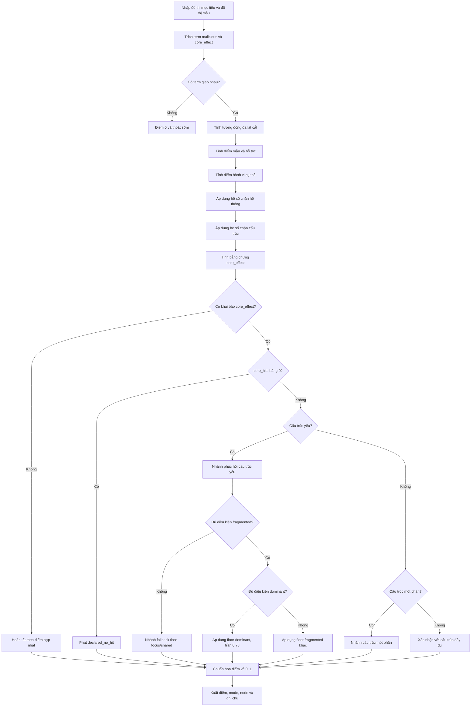
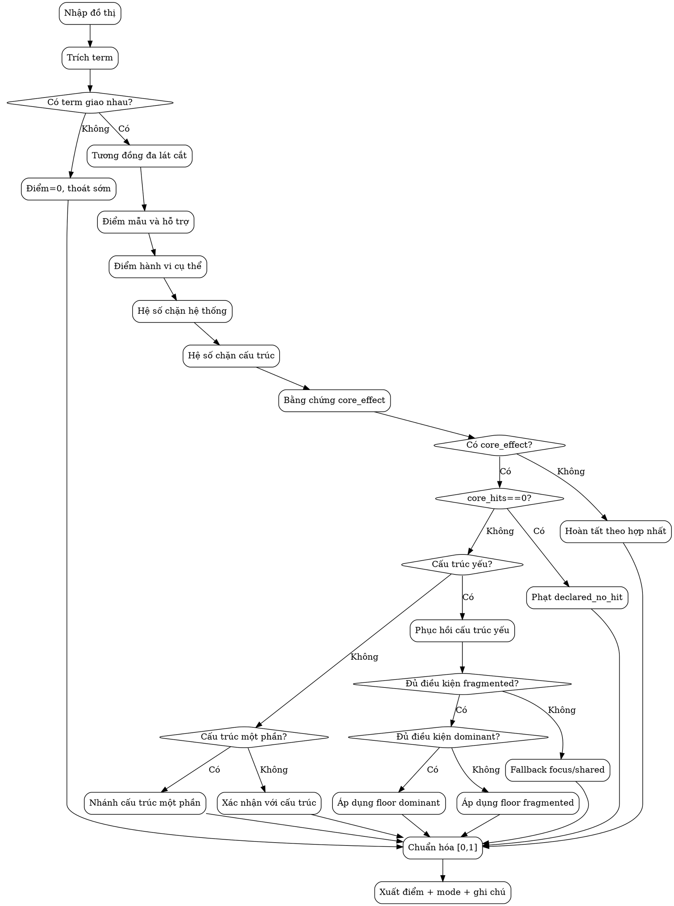

# Phân Tích Thuật Toán Behavioral Anchor Fusion

## Tóm tắt

Tài liệu này trình bày lại thuật toán Behavioral Anchor Fusion theo cấu trúc học thuật, mạch lạc và dễ theo dõi. Mục tiêu của thuật toán là ước lượng mức phù hợp giữa đồ thị sự kiện quan sát và đồ thị mẫu kỹ thuật ATT&CK, đồng thời bảo đảm ba yêu cầu: nhận diện đúng hành vi tấn công, hạn chế tăng điểm sai cho kỹ thuật không liên quan, và cung cấp khả năng giải trình cho chuyên gia phân tích.

Khác với cách so khớp chỉ dựa vào từ khóa, thuật toán kết hợp nhiều lớp bằng chứng: từ khóa hành vi, đặc trưng cấu trúc đồ thị, thành phần hệ thống, và độ mạnh của bằng chứng core_effect. Đặc biệt, phiên bản hiện tại bổ sung cơ chế nâng điểm có điều kiện rất chặt cho trường hợp cấu trúc phân mảnh nhưng bằng chứng cốt lõi đủ mạnh.

---

## 1) Bối cảnh và mục tiêu nghiên cứu

Trong dữ liệu giám sát hệ thống, cùng một kỹ thuật ATT&CK có thể xuất hiện dưới nhiều biến thể thực thi. Điều này dẫn đến hai khó khăn:

1. Nếu quá phụ thuộc vào từ khóa, hệ thống dễ phát hiện nhầm.
2. Nếu quá phụ thuộc vào cấu trúc chuẩn, hệ thống có thể bỏ sót khi đồ thị bị phân mảnh.

Vì vậy, thuật toán cần cân bằng giữa độ nhạy và độ chính xác, đồng thời có cơ chế bù hợp lý khi bằng chứng cốt lõi rõ ràng nhưng cấu trúc chưa hoàn chỉnh.

Mục tiêu cụ thể:

- Tính điểm khớp trong khoảng [0, 1] cho từng kỹ thuật.
- Ưu tiên bằng chứng hành vi có ý nghĩa thực thi.
- Chặn tăng điểm không hợp lệ bằng các hệ số kiểm soát.
- Xuất lý do chấm điểm dưới dạng bản ghi giải thích.

---

## 2) Mô hình đầu vào và đầu ra

### 2.1 Đầu vào

- Đồ thị mục tiêu: G_t = (V_t, E_t)
- Đồ thị mẫu kỹ thuật: G_p = (V_p, E_p)
- Tập mẫu hành vi độc hại: M_p
- Tập mẫu hiệu ứng cốt lõi: C_p

### 2.2 Đầu ra

- Điểm khớp kỹ thuật: s thuộc [0, 1]
- Tập node nổi bật được match
- Chuỗi diễn giải gồm thành phần điểm, hệ số chặn, trạng thái xác nhận

---

## 3) Quy trình phương pháp (từ tổng quát đến chi tiết)

Thuật toán gồm chín bước chính:

1. Trích mẫu malicious và core_effect từ đồ thị kỹ thuật.
2. Quét văn bản node mục tiêu để tìm bằng chứng trùng khớp.
3. Thoát sớm nếu không có bằng chứng malicious/core_effect.
4. Trích đặc trưng đa lát cắt của hai đồ thị.
5. Tính tương đồng Jaccard có trọng số cho từng lát cắt.
6. Tính điểm hỗ trợ mẫu hành vi và điểm hành vi cụ thể.
7. Áp dụng hệ số chặn theo thành phần hệ thống.
8. Áp dụng hệ số chặn theo mức nhất quán cấu trúc.
9. Áp dụng nhánh xác nhận core_effect và chuẩn hóa điểm cuối.

Cách tổ chức này giúp thuật toán vừa có khả năng sàng lọc nhanh, vừa có chiều sâu trong phần xác nhận bằng chứng.

---

## 4) Đặc trưng và đo tương đồng

### 4.1 Các lát cắt đặc trưng

Năm lát cắt được sử dụng:

- Neo hành vi (anchor)
- Đối tượng (object)
- Quan hệ (relation)
- Hình thái đồ thị (shape)
- Quan hệ theo thành phần hệ thống (system_relation)

### 4.2 Jaccard có trọng số

Với hai véc-tơ đếm A và B:

S(A, B) = sum_k min(A_k, B_k) / sum_k max(A_k, B_k)

Cách đo này phù hợp với dữ liệu đồ thị có tần suất không đồng đều giữa các đặc trưng.

---

## 5) Cụm điểm hành vi

### 5.1 Điểm bao phủ mẫu hành vi

Điểm mẫu hành vi được tính theo hai thành phần:

- Mức bao phủ theo trọng số độ đặc hiệu của term.
- Mức cục bộ theo số node liên quan.

Công thức:

pattern_score = 0.78 * coverage_weighted + 0.22 * locality

### 5.2 Mức hỗ trợ mẫu

pattern_support là hàm bậc thang theo khối lượng term đã match:

- Mức thấp: 0.35
- Mức trung bình: 0.70
- Mức cao: 1.00

### 5.3 Điểm hành vi cụ thể

concrete_score phản ánh mức độ cụ thể của dấu hiệu thực thi (lệnh, tham số, chuỗi hành vi có ngữ nghĩa tấn công rõ).

### 5.4 Hỗ trợ đồng hiện malicious-core

Khi term malicious và core_effect đồng hiện, thuật toán cộng thêm phần hỗ trợ đồng thuận:

shared_behavior_support = clamp(shared_strength * (0.55 + 0.45 * concrete_score), 0, 1)

supported_pattern_score = min(1.0, pattern_score * pattern_support + 0.18 * shared_behavior_support)

---

## 6) Công thức hợp nhất cơ sở

Điểm hợp nhất ban đầu:

fused =
  0.48 * supported_pattern_score +
  0.12 * anchor_score +
  0.06 * object_score +
  0.05 * relation_score +
  0.03 * shape_score +
  0.06 * system_relation_score +
  0.08 * concrete_score +
  0.12 * structure_precision

Sau bước này, thuật toán tiếp tục áp dụng các hệ số chặn để tránh tăng điểm thiếu kiểm soát.

---

## 7) Hệ số chặn theo hệ thống

Đặt:

- S_p: tập thành phần hệ thống kỳ vọng từ mẫu kỹ thuật
- S_t: tập thành phần hệ thống quan sát trên đồ thị mục tiêu

Tỷ lệ chồng lấp:

system_component_ratio = |S_p intersect S_t| / |S_p|

Cơ chế chặn:

- Nếu kỹ thuật không có thành phần hệ thống kỳ vọng: gate = 1.0
- Nếu có kỳ vọng:
  - ratio >= system_component_min_ratio -> gate = 1.0
  - ratio < system_component_min_ratio -> gate = max(0.05, ratio / system_component_min_ratio)

Ngưỡng mặc định:

system_component_min_ratio = 0.50

Ý nghĩa: kỹ thuật chỉ được giữ điểm cao khi bối cảnh thành phần hệ thống phù hợp.

---

## 8) Nhất quán cấu trúc và hệ số chặn cấu trúc

### 8.1 Thành phần đo cấu trúc

Thuật toán tính:

- semantic_coverage
- type_coverage
- root_semantic_coverage
- root_type_coverage
- purity
- focus_coverage
- component_focus_overlap

Điểm chính:

precision = 0.68 * semantic_coverage + 0.32 * type_coverage

### 8.2 Tinh chỉnh theo thành phần thực thi

Thay vì đánh giá toàn đồ thị một lần, thuật toán:

1. Tách các thành phần thực thi liên thông.
2. Chấm từng thành phần ứng viên.
3. Chọn thành phần tốt nhất theo structural_candidate_score.
4. Trộn kết quả baseline và kết quả thành phần tốt nhất.

Cách làm này giúp giảm nhiễu nền và tăng khả năng bắt đúng lõi hành vi.

### 8.3 Ngưỡng cấu trúc mặc định

- structure_precision_hard_floor = 0.28
- structure_precision_soft_floor = 0.44

Nếu cấu trúc dưới hard floor, hệ số chặn giảm mạnh. Tuy nhiên vẫn có cơ chế "nới có điều kiện" khi bằng chứng core_effect và độ tập trung thành phần cùng đủ cao.

---

## 9) Mô hình bằng chứng core_effect

Từ tập core term đã match, thuật toán tính:

hit_saturation = 1 - 0.58^hits

confidence_strength = clamp(weighted_confidence / 1.60, 0, 1)

evidence_strength = 0.42 * hit_saturation + 0.58 * confidence_strength

Ba giá trị tương ứng trong mã:

- core_hit_saturation
- core_confidence_strength
- core_boost_ratio

Độ mạnh xác nhận hành vi:

behavioral_confirmation_strength = clamp(
  0.46 * supported_pattern_score +
  0.24 * concrete_score +
  0.18 * core_boost_ratio +
  0.07 * system_component_ratio +
  0.05 * strongest_concrete,
0, 1)

Ý nghĩa: không chỉ đếm số term, mà còn xét chất lượng term và mức nhất quán ngữ cảnh.

---

## 10) Cơ chế phục hồi cho cấu trúc yếu hoặc phân mảnh

Trong thực tế, đồ thị có thể bị thiếu cạnh, thiếu node hoặc bị chia nhỏ theo tiến trình. Thuật toán dùng các nhánh phục hồi nhưng đều có khóa điều kiện nghiêm ngặt:

- fragmented_confirmation
- core_behavioral_confirmation
- fragmented_high_signal_confirmation
- fragmented_cohesive_confirmation
- variant_focus_confirmation
- focus_supported_confirmation
- single_core_shared_confirmation
- artifact_execution_confirmation

Mỗi nhánh có công thức floor và trần điểm riêng, nhằm tránh hiện tượng "nâng điểm bừa".

---

## 11) Nhánh chủ đạo core_effect_dominant

Đây là đóng góp kỹ thuật quan trọng của phiên bản hiện tại.

### 11.1 Mục đích

Cho phép nâng điểm đáng kể khi cấu trúc chưa lý tưởng nhưng bằng chứng cốt lõi hội đủ độ mạnh, độ cụ thể và độ đồng thuận hệ thống.

### 11.2 Điều kiện kích hoạt (đồng thời)

- core_confirmation_eligible
- core_hits >= 3
- core_hit_saturation >= 0.75
- core_boost_ratio >= 0.60
- core_confidence_strength >= 0.50
- behavioral_confirmation_strength >= 0.55
- pattern_support >= 0.95
- supported_pattern_score >= 0.45
- concrete_score >= 0.65
- strongest_concrete >= 0.95
- structure_precision >= max(0.20, 0.72 * hard_floor)
- structure_purity >= 0.55
- variant_focus_alignment >= 0.80
- structure_component_focus_overlap >= 0.95
- system_component_ratio >= 0.50
- shared_behavior_support >= 0.50

### 11.3 Công thức floor

core_effect_dominant_floor =
  0.30 +
  0.18 * behavioral_confirmation_strength +
  0.13 * core_boost_ratio +
  0.09 * core_confidence_strength +
  0.08 * supported_pattern_score +
  0.06 * concrete_score +
  0.05 * shared_behavior_support +
  0.04 * system_component_ratio +
  0.03 * structure_precision +
  0.03 * structure_purity +
  bonus_terms

Áp dụng:

fragmented_floor = max(fragmented_floor, min(0.78, core_effect_dominant_floor))

Mode giải thích:

core_hit_core_effect_dominant

### 11.4 Ý nghĩa phương pháp luận

Nhánh này giải quyết mâu thuẫn cốt lõi: "cấu trúc chưa đẹp" nhưng "bằng chứng lõi rất mạnh". Điểm chỉ tăng cao khi toàn bộ trục bằng chứng cùng đồng thuận, nên vẫn giữ được an toàn trước sai số lan rộng.

---

## 12) Cơ chế giải trình

Chuỗi ghi chú đầu ra bao gồm:

- Tỷ lệ term match và điểm mẫu
- Mức hỗ trợ
- Tương đồng theo từng lát cắt
- Cường độ hành vi cụ thể
- Mức đồng hiện malicious/core
- Chồng lấp thành phần hệ thống và hệ số chặn
- Tóm tắt cấu trúc (semantic/type/root/purity/focus)
- Tóm tắt core (số hit, saturation, confidence, mode)

Nhờ vậy, chuyên gia có thể kiểm tra nhanh lý do hệ thống đưa ra điểm cao hay thấp.

---

## 13) Lưu đồ thuật toán

### 13.1 Lưu đồ Mermaid (Việt hóa nhãn)

### 13.2 Lưu đồ Graphviz DOT (Việt hóa nhãn)

---

## 14) Khung đánh giá thực nghiệm

### 14.1 Chất lượng phát hiện

- Precision, Recall, F1 theo từng kỹ thuật
- Tỷ lệ xuất hiện đúng trong top-k

### 14.2 Độ ổn định khi tinh chỉnh

- Số lượng regression sau mỗi bản sửa
- Mức lệch điểm của các kỹ thuật ngoài mục tiêu

### 14.3 Hiệu chuẩn điểm

- Mức tách bạch phân bố điểm giữa dương tính đúng và dương tính giả
- Độ tin cậy theo từng dải điểm để phục vụ phân tầng cảnh báo

### 14.4 Giá trị giải trình

- Mức đồng thuận của chuyên gia với mode hệ thống phát ra
- Thời gian phân tích giảm bao nhiêu khi có chuỗi ghi chú

---

## 15) Kết quả kiểm chứng gần nhất

Trên tập ca kiểm chứng gần đây:

- Ca mục tiêu T1053.005 tăng từ mức tin cậy thấp-trung bình lên mức cao.
- Điểm replay cuối đạt xấp xỉ 0.704656 với mode core_hit_core_effect_dominant.
- Đánh giá A/B ở vòng sửa gần nhất ghi nhận changed_count=2 và regressions=0.

Kết quả này cho thấy cơ chế nâng điểm mới đạt đúng mục tiêu: tăng điểm có chọn lọc ở ca khó, nhưng không làm xấu các kỹ thuật còn lại.

---

## 16) Đóng góp chính của phương pháp

1. Kết hợp đa lát cắt đặc trưng đồ thị thay cho so khớp từ khóa thuần túy.
2. Lượng hóa bằng chứng core_effect bằng mô hình bão hòa và độ tin cậy.
3. Bổ sung đánh giá cấu trúc theo thành phần thực thi để giảm nhiễu.
4. Thiết kế nhánh core_effect_dominant với điều kiện nghiêm ngặt cho ca phân mảnh.
5. Cung cấp cơ chế giải trình rõ ràng qua mode và chuỗi ghi chú chi tiết.

---

## 17) Quy trình tái lập khuyến nghị

Để tái lập kết quả một cách nhất quán:

1. Cố định tập snapshot và thứ tự xử lý.
2. Chạy A/B trước-sau trong cùng môi trường thực thi.
3. Báo cáo đầy đủ changed_count, regressions, delta theo kỹ thuật, và mode transition.
4. Trình bày song song chỉ số tổng hợp và các ca khó đại diện.

Tài liệu này có thể dùng trực tiếp cho phần phương pháp và kết quả trong bài báo, đồng thời phù hợp làm tài liệu kỹ thuật nội bộ cho nhóm phát triển và nhóm phân tích.
